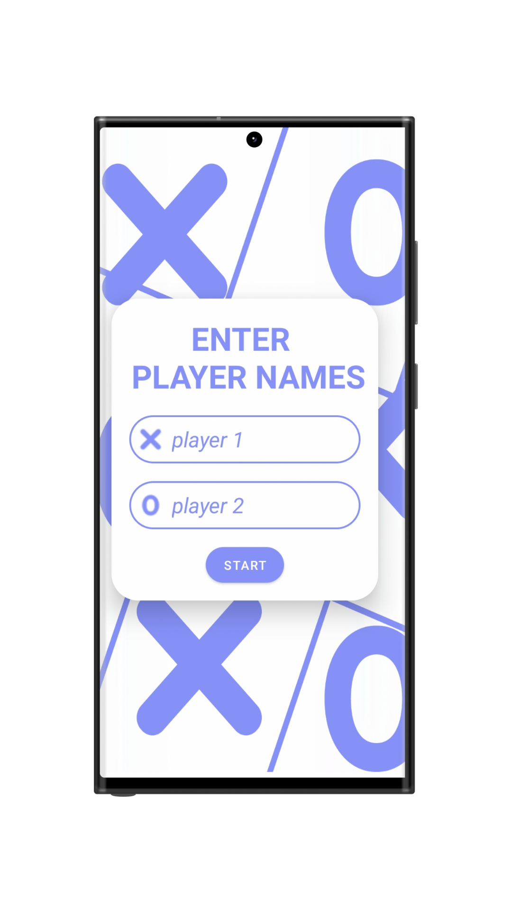
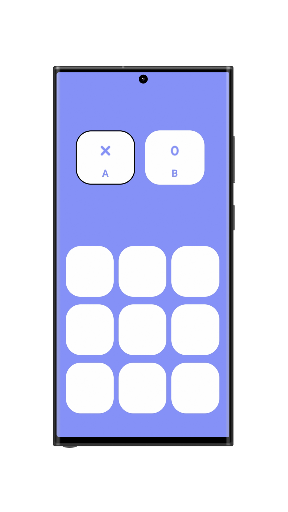
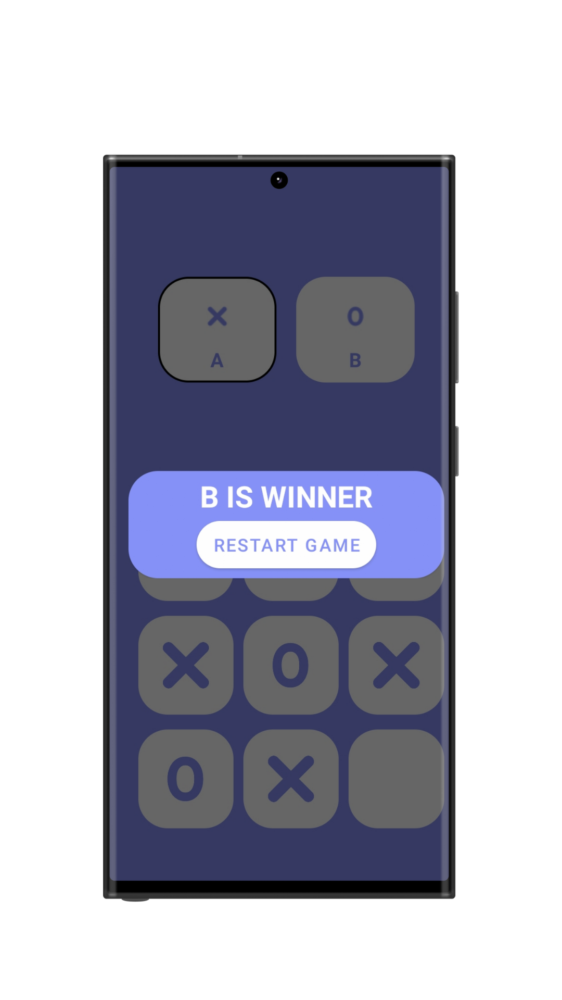

# Tic Tac Toe Android App

## Table of Contents
- [Introduction](#introduction)
- [Features](#features)
- [Screenshots](#screenshots)
- [Installation](#installation)
- [Usage](#usage)
- [Contributing](#contributing)
- [Acknowledgments](#acknowledgments)

## Introduction
The Tic Tac Toe Android App is a simple, fun game designed for two players. Each player takes turns marking a square in a 3x3 grid. The player who succeeds in placing three of their marks in a horizontal, vertical, or diagonal row wins the game. This app is developed using Java.

## Features
- Player vs. Player mode
- User-friendly interface
- Winner popup for X and O
- Draw result notification
- Easy to start a new game

## Screenshots
### Main Menu


### Gameplay Screen


### Winner Popup


## Installation
To run this app on your local machine, follow these steps:

1. **Clone the repository:**
   ```bash
   git clone https://github.com/rakeshreddyadina/TicTacToe.git
2. **Open the project in Android Studio:**
  - Open Android Studio.
  - Click on File -> Open....
  - Navigate to the cloned repository folder and select it.
  ## Usage
1. **Start the app:**
   - Open the Tic Tac Toe app on your Android device.
   
2. **Play the game:**
   - The main menu screen will appear. Click "Start Game" to begin.
   - Take turns tapping on the grid to place your marks (X or O).
   - The game will announce the winner or declare a draw.
   
3. **Start a new game:**
   - Click the "New Game" button to reset the board and play again.

## Contributing
Contributions are welcome! If you have suggestions or bug reports, please open an issue or submit a pull request. For major changes, please open an issue first to discuss what you would like to change.

1. **Fork the repository**
2. **Create a new branch:**
   ```bash
   git checkout -b feature-branch
3. **Make your changes and commit:**
   ```bash
   git commit -m 'Add some feature'\
4. **Open a pull request**

## Acknowledgments
Thanks to the Android developer community for the valuable resources and tutorials.
